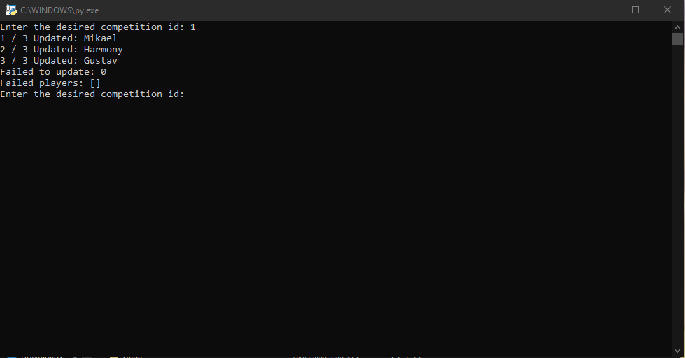

# TempleOSRS-Auto-Updater
Takes in a competition ID for a templeOSRS competition and will update every player in that competition.

# GetCompetitionMembers
Takes in a competition ID for a templeOSRS competition and will print to both the console and a file called Members.txt in the installed folder.

